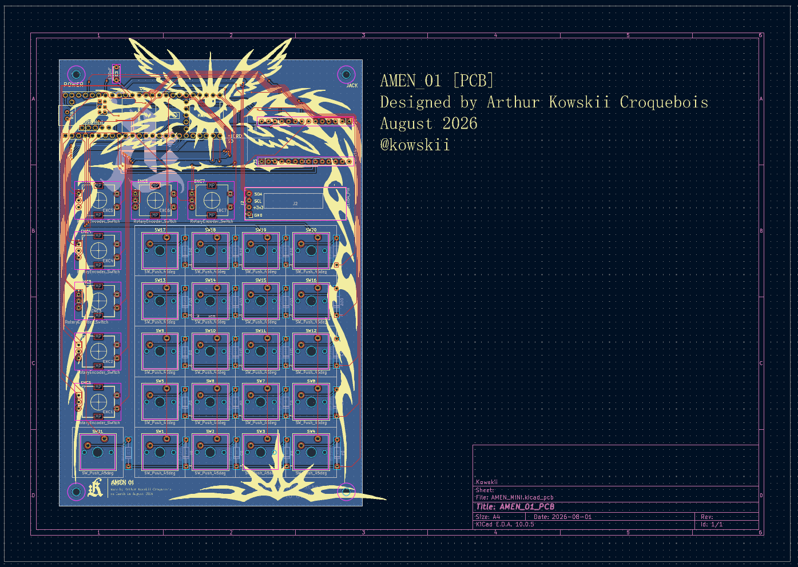
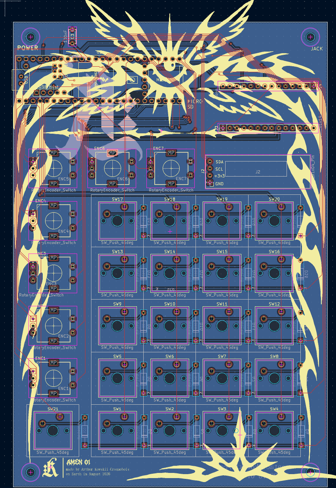
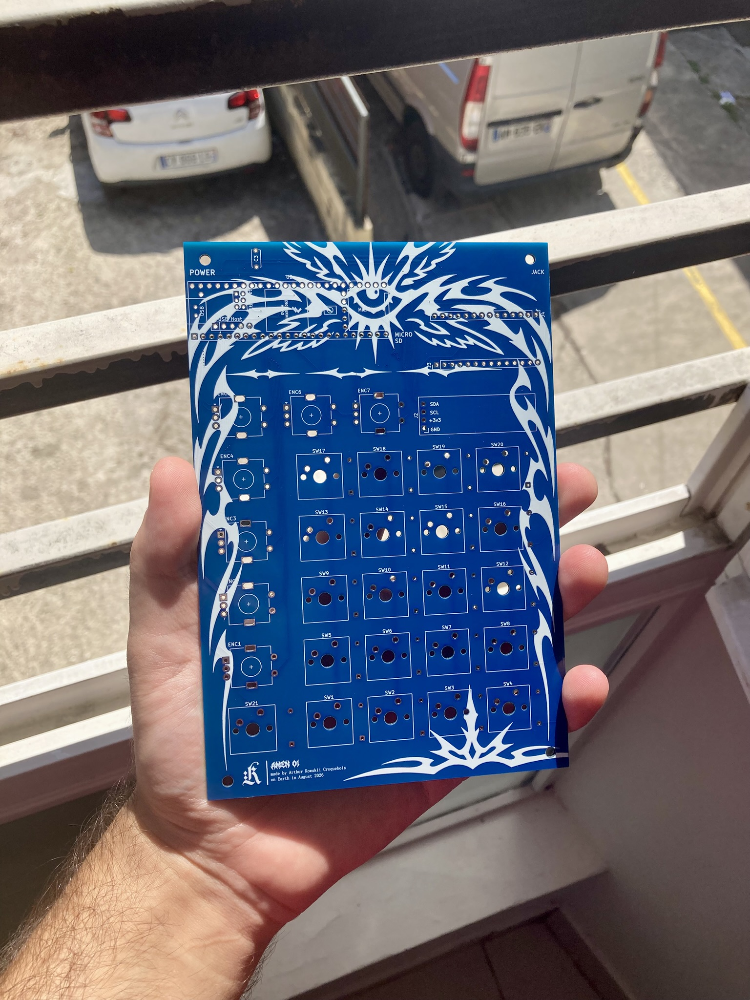
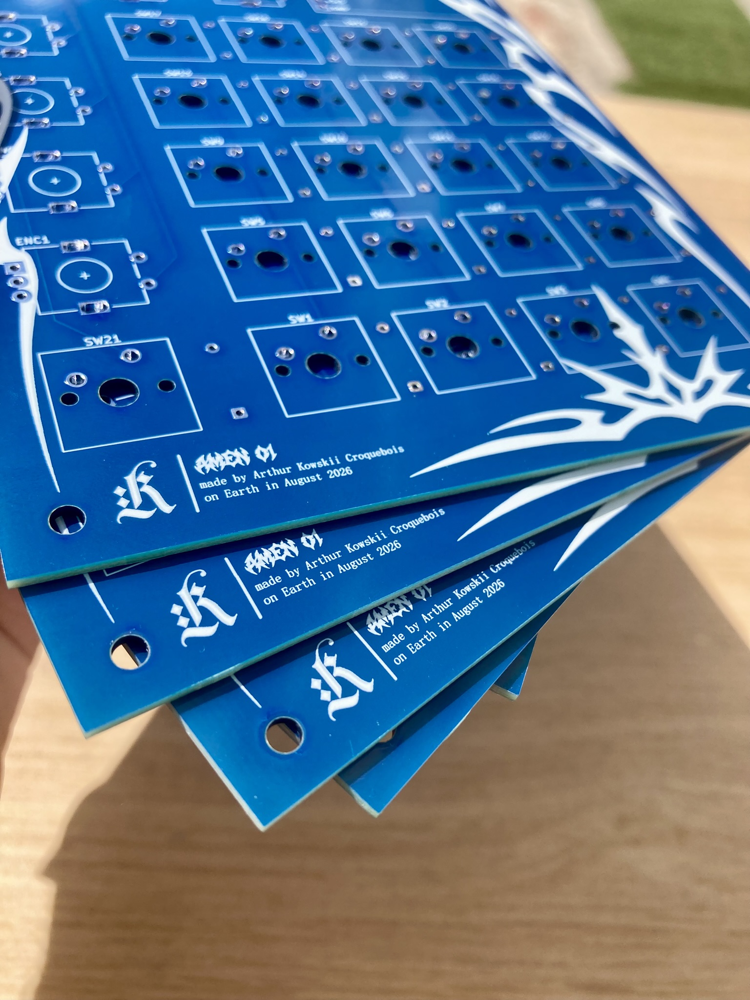

# AMEN_MINI

AMEN_MINI is a standalone break machine: drop a break on the SD card, slice it, and play it live on 12 pads.

## The PCB

### Blueprints (KiCad)

### The assembled board

The board is a 2-layer, 1.6 mm PCB hosting a socketed Teensy 4.1, with the PJRC Audio Adapter (SGTL5000) plugged into J3/J4. Ordering and assembly details live in `hardware/BOM_AMEN_MINI.csv`.

## Hardware

- **Teensy 4.1** (Cortex-M7, 600 MHz) — control processor, native microSD, USB, 8 MB PSRAM;
- **PJRC Audio Adapter SGTL5000** — headphone + line output, onboard mic input pads (direct recording, J15);
- 21 MX-compatible switches: 12 chop pads + 8 FX pads + Shift;
- 7 EC11 push encoders;
- SSD1306 I²C OLED, 0.91″, 128 × 32;
- WAV 16-bit / 44.1 kHz loaded from SD and decoded once into PSRAM — voices read from RAM (random access), never from the SD card inside the audio callback.

## Firmware

- `firmware/src/engine/` — portable C++17 audio engine (WAV loader, sample player, voice pool with oldest-voice stealing, granular mode, FX: repeat, reverse, phase distortion, spectral gate, spectral freeze), zero Arduino/Teensy includes;
- `firmware/test_native/` — PC listening harness (`amen_rt.exe`) simulating the front panel: pads, encoders, OLED preview, SD browser;
- `firmware/src/teensy/` — Teensy layer: PSRAM arena, SD WAV reader, sample loader, `firmware.ino`;
- Workflow LOAD → MUTATE → COMMIT: auto-assign a break into 12 slices, mutate it live (granular cloud, trance gate, freeze), and commit the last 15 seconds of the mix as new assignable material;
- Docs: `firmware/docs/CONCEPT.md`, `firmware/docs/CONTROLS.md`, `firmware/docs/ROADMAP.md`.

## Status

- **Hardware**: PCB fabricated and photographed (above). The Teensy 4.1 + Audio Adapter build is the current target.
- **Firmware**: active development on the `dev` branch (never `main`). The engine and the PC harness are shipped; the Teensy integration layer (J12/J13) is in progress. See `firmware/docs/ROADMAP.md` for milestones and verification criteria.
